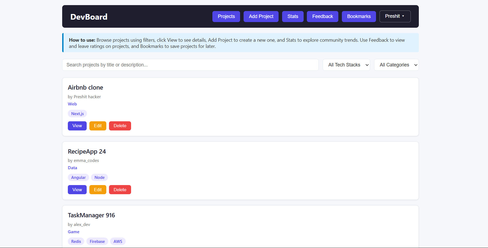

# DevBoard - Developer Project Showcase & Discovery Platform

A community - driven full stack web application where developers showcase projects, discover peer work, and share feedback.

## Authors

- Preshit Ravindra Pimple
- Gurudatt Pramod Gaonkar

## Class

[CS5610 Web Development - Spring 2026](https://johnguerra.co/classes/webDevelopment_spring_2025/)

## Project Objective

DevBoard solves the problem of developers having no dedicated lightweight platform to showcase their projects and get meaningful peer feedback. LinkedIn is too formal, GitHub is too technical, and portfolios are static. DevBoard provides:

- A community feed where developers post projects with tech stack tags, GitHub links, and demo URLs
- Peer discovery - browse and search projects by tech stack, category, or title
- Community feedback with star ratings and comments
- Bookmark projects to revisit later
- Community stats showing trending tech stacks and categories
- Secure authentication with user accounts

## Screenshot



## Live Demo

🌐 **Frontend:** https://devboard-frontend.onrender.com

🔗 **Backend API:** https://devboard-backend-lmk8.onrender.com

⚠️ **Note:** Free tier instances spin down after inactivity. First request may take 50+ seconds to wake up. Subsequent requests are fast.

## Features

### Projects

- ✅ Create, edit, delete and browse developer projects
- ✅ Filter projects by tech stack and category
- ✅ Search projects by title
- ✅ Pagination - 10 projects per page
- ✅ Sort by most recent

### Feedback

- ✅ Leave star ratings (1-5) and comments on projects
- ✅ Edit and delete feedback
- ✅ Sort feedback by most recent, highest or lowest rating
- ✅ Pagination - 10 feedback items per page
- ✅ View project title on each feedback item

### Bookmarks

- ✅ Bookmark projects for later
- ✅ Add and edit notes on bookmarks
- ✅ Delete bookmarks
- ✅ Pagination - 10 bookmarks per page
- ✅ Bookmarks tied to logged in user

### Authentication

- ✅ User registration and login
- ✅ Passport.js local strategy
- ✅ Session-based authentication with express-session
- ✅ User context across all components

### Stats

- ✅ Top 5 most used tech stacks
- ✅ Top categories by project count

## Tech Stack

- **Frontend:** React with Hooks (client-side rendering)
- **Backend:** Node.js + Express
- **Database:** MongoDB Atlas (native Node.js driver - no Mongoose)
- **Authentication:** Passport.js + express-session
- **Code Quality:** ESLint, Prettier
- **Deployment:** Render.com

## Design Document

📄 [Design Document](docs/design-document.pdf)

## Video Demo

🎥 [Project Walkthrough Video](your_youtube_link_here)

## MongoDB Collections

| Collection | Owner                   | Description                                   |
| ---------- | ----------------------- | --------------------------------------------- |
| projects   | Preshit Pimple          | Developer project listings with full CRUD     |
| users      | Preshit Pimple          | Registered user accounts with authentication  |
| feedback   | Gurudatt Pramod Gaonkar | Community ratings and comments with full CRUD |
| bookmarks  | Gurudatt Pramod Gaonkar | Saved projects per user with full CRUD        |

## Instructions to Build Locally

### Prerequisites

- Node.js (v18 or higher)
- MongoDB Atlas account
- Git
- npm

### 1. Clone the Repository

```bash
git clone https://github.com/Preshit13/DevBoard.git
cd DevBoard
```

### 2. Backend Setup

```bash
cd backend
npm install
```

Create a `.env` file in the `backend/` folder using `.env.example` as reference:

```
MONGO_URI=your_mongo_connection_string_here
PORT=5000
SESSION_SECRET=your_session_secret_here
```

Start the backend:

```bash
npm start
```

### 3. Seed the Database

To populate the database with 1000+ synthetic records:

```bash
node src/seed/seed.js
```

### 4. Frontend Setup

Open a new terminal:

```bash
cd frontend
npm install
npm start
```

The app will open at `http://localhost:3000`

## Development Scripts

### Backend

```bash
npm start        # Start the backend server
npm run lint     # Run ESLint
npm run format   # Format code with Prettier
```

### Frontend

```bash
npm start        # Start React development server
npm run build    # Build for production
npm run lint     # Run ESLint
npm run format   # Format code with Prettier
```

## API Endpoints

### Authentication

| Method | Endpoint       | Description       |
| ------ | -------------- | ----------------- |
| POST   | /auth/register | Register new user |
| POST   | /auth/login    | Login user        |
| POST   | /auth/logout   | Logout user       |
| GET    | /auth/me       | Get current user  |

### Projects

| Method | Endpoint            | Description                                  |
| ------ | ------------------- | -------------------------------------------- |
| GET    | /api/projects       | Get all projects with filters and pagination |
| GET    | /api/projects/stats | Get tech stack and category stats            |
| GET    | /api/projects/:id   | Get single project                           |
| POST   | /api/projects       | Create project                               |
| PUT    | /api/projects/:id   | Update project                               |
| DELETE | /api/projects/:id   | Delete project                               |

### Feedback

| Method | Endpoint                         | Description                               |
| ------ | -------------------------------- | ----------------------------------------- |
| GET    | /api/feedback                    | Get all feedback with sort and pagination |
| GET    | /api/feedback/project/:projectId | Get feedback for a project                |
| GET    | /api/feedback/:id                | Get single feedback                       |
| POST   | /api/feedback                    | Create feedback                           |
| PUT    | /api/feedback/:id                | Update feedback                           |
| DELETE | /api/feedback/:id                | Delete feedback                           |

### Bookmarks

| Method | Endpoint                      | Description           |
| ------ | ----------------------------- | --------------------- |
| GET    | /api/bookmarks                | Get all bookmarks     |
| GET    | /api/bookmarks/user/:userName | Get bookmarks by user |
| GET    | /api/bookmarks/:id            | Get single bookmark   |
| POST   | /api/bookmarks                | Create bookmark       |
| PUT    | /api/bookmarks/:id            | Update bookmark note  |
| DELETE | /api/bookmarks/:id            | Delete bookmark       |

## Project Structure

```
DevBoard/
├── backend/
│   ├── src/
│   │   ├── db/
│   │   │   └── connection.js         # MongoDB connection
│   │   ├── routes/
│   │   │   ├── auth.js               # Authentication routes
│   │   │   ├── projects.js           # Projects CRUD routes
│   │   │   ├── feedback.js           # Feedback CRUD routes
│   │   │   └── bookmarks.js          # Bookmarks CRUD routes
│   │   ├── seed/
│   │   │   └── seed.js               # Database seeding script
│   │   └── server.js                 # Express app entry point
│   ├── .env.example                  # Environment variables template
│   ├── .eslintrc.json                # ESLint configuration
│   ├── .prettierrc                   # Prettier configuration
│   └── package.json                  # Backend dependencies
├── frontend/
│   ├── src/
│   │   ├── components/
│   │   │   ├── ProjectList.js        # Project listing with pagination
│   │   │   ├── ProjectCard.js        # Single project card
│   │   │   ├── ProjectForm.js        # Create/edit project form
│   │   │   ├── ProjectDetail.js      # Project detail view
│   │   │   ├── ProjectFilter.js      # Filter and search bar
│   │   │   ├── StatsPanel.js         # Community stats
│   │   │   ├── FeedbackList.js       # Feedback listing
│   │   │   ├── FeedbackForm.js       # Create/edit feedback form
│   │   │   ├── RatingSort.js         # Feedback sort control
│   │   │   ├── BookmarkList.js       # Bookmark listing
│   │   │   ├── BookmarkCard.js       # Single bookmark card
│   │   │   ├── Pagination.js         # Reusable pagination component
│   │   │   ├── Login.js              # Login form
│   │   │   └── Register.js           # Registration form
│   │   ├── context/
│   │   │   └── UserContext.js        # Auth state context
│   │   ├── App.js                    # Main app component
│   │   └── index.js                  # React entry point
│   ├── .eslintrc.json                # ESLint configuration
│   ├── .prettierrc                   # Prettier configuration
│   └── package.json                  # Frontend dependencies
├── README.md
└── LICENSE
```

## Code Quality

- ✅ ESLint configured and passing with zero errors on both frontend and backend
- ✅ Prettier formatting applied to all files
- ✅ PropTypes defined for every React component
- ✅ No axios, Mongoose, or CORS library used
- ✅ No non-standard HTML tags used for buttons or inputs
- ✅ CSS organized by component - each component has its own CSS file
- ✅ No leftover unused code or default React files
- ✅ Credentials secured with .env file (never committed)

## License

This project is licensed under the MIT License - see the [LICENSE](LICENSE) file for details.

## Acknowledgments

- **Course:** CS5610 Web Development, Northeastern University
- **Instructor:** Professor John Alexis Guerra Gomez
- **Database:** MongoDB Atlas
- **Deployment:** Render.com
- **Built with:** Node.js, Express, MongoDB, and React

---

**CS5610 Web Development - Spring 2026**
**Northeastern University**
